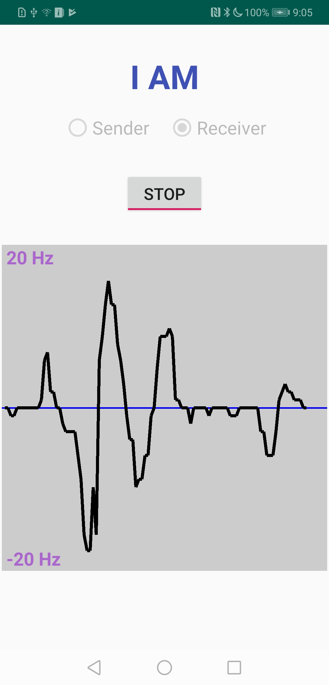

# dtc-doppler-illustrator

&nbsp;
  

Illustrating acoustic Doppler effect using Android phones

Two phones are required: one for emitting inaudible sounds and the other for calculating and displaying Doppler

## Screenshot

   

(Screenshot from Huawei Mate 20)

## Code Structure

It has mainly two components

1.  The sender part is implemented in the `PlaySound.java` class, which emits sounds of a single frequency. The phone sends out sounds of 19 KHz. You can easily change to other frequencies if you like. For details please refer to my repo [dtc-frequency-player](https://github.com/dtczhl/dtc-frequency-player)

2.  The receiver part is implemented in the `AnalyzeFrequency.java` class. The acoustic signals go through the following processing

  1)  receive sounds. Details see my repo [dtc-acoustic-spectrumer](https://github.com/dtczhl/dtc-acoustic-spectrumer)

  2)  filtering. We apply a bandpass filter that only allows signals within \[18KHz, 21KHz\]. There is a very convenient Android app named *FIR Filter Designer* that can generate Java code for you. The higher order of filters cause greater computation overhead.

  2)  undersampling and overlapping. Undersampling is applied to increase the frequency resolution and overlapping is used to increase temporal fidelity. We use 8X undersampling and 0.875 overlapping.

  3)  window function. We apply Blackman-Harris window to smooth the spectrum. You can try other window functions as well. <https://en.wikipedia.org/wiki/Window_function>

  4)  Fast-Fourier Transform (FFT). Details see my repo [dtc-acoustic-spectrumer](https://github.com/dtczhl/dtc-acoustic-spectrumer)

  5)  calculate Doppler shift. Since we know that the sender's signal is 19 KHz, we only need to calculate the received frequency (with the strongest magnitude) minus 19 KHz.

## More Details

This repo is part of my project. More details could refer to my paper   
[Paper](https://www.huanlezhang.com/publication/conference/dopenc_mobicom_16/paper.pdf) DopEnc: Acoustic-based Encounter Profiling Using Smartphones, published in ACM Conference on Mobile Computing and Networking (MobiCom), 2016
Or [Paper](https://www.huanlezhang.com/publication/journal/dopenc_tmc_18/paper.pdf) An Acoustic-Based Encounter Profiling System, published in IEEE Transactions on Mobile Computing (TMC), 2018

Please also consider to cite my papers. Thank you.

## Notes

*   See branch `multi-channel` for the old version which supports multiple channel reception. 

## Phones Tested
*   Huawei Mate 20
*   Google Pixel 2
